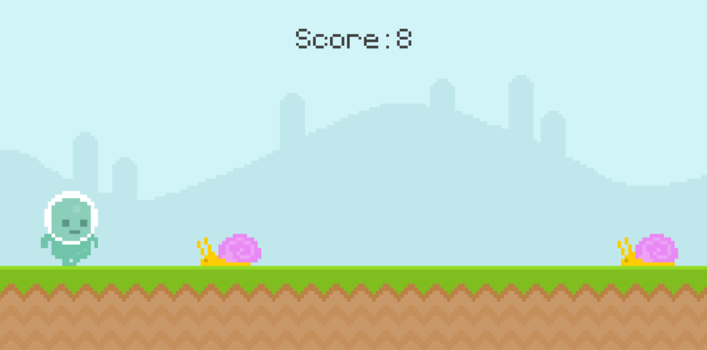
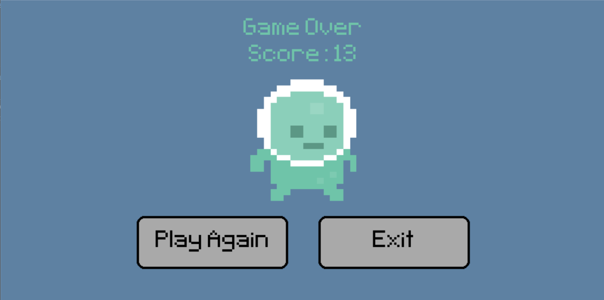

# Runner Game

Welcome to the **Runner Game**, a simple yet addictive 2D platformer built using Python and Pygame. The objective of the game is to navigate the player character through obstacles, jumping over them to achieve the highest possible score. This project was a fun way to practice your Python skills and learn about game development using Pygame.

## Technologies Used

- **Python**: The core programming language used to develop the game.
- **Pygame**: A set of Python modules designed for writing video games. It includes computer graphics and sound libraries.

## Game Example:

Below is a screenshot of the game in action:


    

## Game Instructions

- **Objective**: Avoid the obstacles (snails and flies) by jumping over them. The game ends if the player collides with an obstacle.
- **Controls**: Spacebar to Jump.
- **Scoring**: The score increases as time progresses. The longer you survive, the higher your score.

## Features

- **Animated Obstacles**: Randomly generated snails and flies that move toward the player, with smooth frame-by-frame animations to simulate motion.
- **Dynamic Player Animation**: The player character features fluid animations, including a walking and jumping sequence, adding realism to movements.
- **Real-Time Scoring**: A live score display that tracks and shows your current score as time progresses.
- **Audio Effects**: Includes sound effects for jumping and background music to enhance the overall gaming experience.
- **Game Over Screen**: A polished screen that displays the final score and provides options to replay or exit the game.

## How to Run the Game

1. **Download the Repository**: Clone or download the repository to your local machine.

    ```bash
    git clone https://github.com/yourusername/runner-game.git
    cd runner-game
    ```

2. **Run the Game**: Simply double-click on the `play_runner.bat` file to start the game.

3. **Enjoy the Game**: Start playing and try to achieve the highest score!


